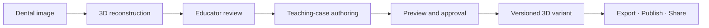
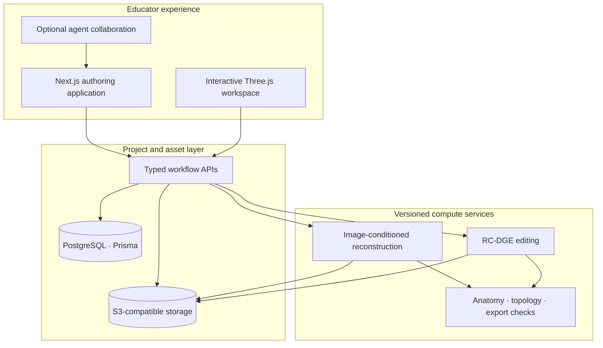

<div align="center">
  

  # DentalSculptor

  ### Turn a dental image into a teachable 3D experience.

  **DentalSculptor is an educator-controlled authoring platform for reconstructing teeth in 3D, creating clinically meaningful teaching cases, and delivering reusable models to learners, simulators and immersive environments.**

  [](https://dentalsculptor.vercel.app/)
  [](https://youtu.be/_k1b-IaoP_8)
  [](./LICENSE)

  *AI-aided 3D content authoring for dental education — with the educator in control.*
</div>


---

## What DentalSculptor makes possible

A dental educator may have a photograph, a teaching intention and access to a virtual simulator—but no practical way to turn those ingredients into a usable 3D exercise. Conventional workflows require specialist modelling skills, several disconnected applications and repeated manual preparation.

DentalSculptor brings that work into one browser-based journey:



An educator can:

- reconstruct a textured 3D tooth proposal from an image;
- inspect the tooth alongside its source and retain both throughout the project;
- use a guided clinical workflow or an open editor to create a teaching variant;
- mark the exact anatomy to change and preview the intended result;
- preserve the accepted master while producing traceable variants;
- download simulator-ready assets or publish, share and clone community projects.

The goal is not simply to generate a mesh. It is to help an educator move from **source material to a defensible, reusable learning object**.

## The core idea

> ### AI proposes. Geometry constrains. The educator decides.

DentalSculptor combines three responsibilities that are often separated:

|  | Responsibility | Role in the platform |
|---|---|---|
| **01 · Reconstruct** | Generative 3D foundation model | Proposes a whole-tooth 3D asset from the educator's selected image. |
| **02 · Author** | Region-constrained geometry operations | Makes bounded, repeatable changes for teaching cases that can be expressed deterministically. |
| **03 · Govern** | Human approval and versioning | Keeps clinical judgement, pedagogical intent and release decisions with the educator. |

This **generative–deterministic framework** is the central contribution of the project. Generative reconstruction provides an accessible starting point. Deterministic editing prevents a local teaching change—such as removing a cusp—from unpredictably reshaping the rest of an accepted tooth.

### Region-Constrained Dental Geometry Editing

The deterministic subsystem is formalised as **RC-DGE**. Every supported edit follows a fail-closed contract:

1. the educator selects a case and identifies the intended anatomy;
2. the marked region must intersect the tooth and satisfy the case constraints;
3. the operation is limited to that region;
4. the resulting mesh is checked for usable geometry and scale;
5. the accepted master remains unchanged;
6. a successful edit is stored as a new, attributable variant.

If those conditions are not met, DentalSculptor preserves the original and explains what needs attention.

## One platform, three authoring routes

| Route | Best for | Experience |
|---|---|---|
| **Use the reconstruction** | A model that is already suitable for the lesson | Inspect, then download or publish without entering the editor. |
| **Create a teaching case** | A known educational objective | A compact, case-specific sequence with only the controls needed for that case. |
| **Open the Free Editor** | Exploration or an uncommon authoring task | Flexible region marking and semantic instruction, still protected by preview and approval gates. |

All three routes use the same project assets, provenance and delivery system. An educator can publish after downloading, download after publishing, or return later to derive another variant.

## Teaching cases

DentalSculptor chooses the least uncertain technique capable of expressing each learning objective.

| Teaching case | Authoring approach | Educational purpose |
|---|---|---|
| **Tooth identification and annotation** | Labels and structured metadata | Recognition of tooth type, position and external landmarks |
| **Cusp fracture / chipped enamel** | Local line cut or subtractive removal | Comparison of intact and fractured morphology |
| **Simple Class I cavity** | Bounded occlusal subtraction | Introduction to cavity position and preparation form |
| **Endodontic access opening** | Controlled access preparation | Orientation and access-cavity discussion |
| **Caries appearance** | Surface appearance with optional shallow geometry | Visual case presentation without claiming tissue simulation |
| **Crown reduction** | Measured surface removal | Demonstration of preparation stages and remaining structure |
| **Jaw placement** | FDI-aware transform and orientation | Positioning authored assets in a wider dental scene |

Each guided case synchronises the case preset, recommended operation, marked region and semantic instruction. The action remains unavailable until the information required for a meaningful edit is present.

## Designed for educators, not 3D specialists

### Pedagogical ownership

The educator chooses the source, teaching intention, affected anatomy, acceptable preview and point of release. Automation assists the work without silently making those decisions.

### Progressive disclosure

Guided cases expose a short, consistent sequence—**Mark → Preview → Create**—instead of presenting every modelling control at once. Advanced controls remain available in the Free Editor.

### Source and model continuity

The input image, master reconstruction, current case, variants and export assets remain associated with one project. Moving between generation, editing and delivery does not discard context.

### Reversible authoring

The master model is immutable. Teaching edits become named variants that can be inspected, compared, exported or discarded independently.

### Honest system state

Generation and editing expose queued, running, finalising, completed and failed states. Long-running work does not masquerade as an unresponsive interface.

## From project to classroom

DentalSculptor treats delivery as part of authoring—not an afterthought.

- **Download:** GLB and STL assets, with simulator-oriented metadata where supported.
- **Export bundles:** models and project context packaged for transfer to other teaching systems.
- **Publish:** a public project page with a visible 3D preview and shareable link.
- **Clone:** another educator can create an owned copy with the model and permitted project assets intact.
- **Community:** published cases support likes, downloads and sharing while retaining attribution.

Exports are educational assets. They are not certified clinical manufacturing files or patient-specific treatment plans.

## Platform architecture



Long-running GPU work is asynchronous. The database records ownership and job state; object storage carries source images, meshes and bundles; compute services return durable artefacts before the project is marked ready. This separation protects the interactive application from reconstruction latency and makes each stage independently testable.

## Anatomy-fidelity research

DentalSculptor builds on the Structured Latent representation of **TRELLIS.2** for image-conditioned reconstruction. The accompanying research programme targets the shortcomings that matter most to dental education: posterior cusp form, fossae, ridges and grooves, incisal enamel extent, cervical continuity and preservation of whole-root morphology.

The proposed research direction is **DSLAT — Dental Disentangled Structured Latents**. Rather than treating a tooth as a single undifferentiated optimisation target, DSLAT separates anatomical responsibilities and promotion gates:

| Anatomical responsibility | Evidence and supervision |
|---|---|
| Tooth identity and orientation | FDI/family metadata and image conditioning |
| Crown and occlusal detail | High-quality dental surface meshes |
| Cervical continuity | Whole-tooth surfaces and regional boundary checks |
| Root form and preservation | Whole-tooth geometry derived from volumetric labels |

The research pipeline includes patient-disjoint cohorts, frozen baselines, deterministic repeats, regional Chamfer and topology measures, tooth-family reporting, root/cervical non-regression gates and blinded expert review. A candidate is not described as anatomically improved merely because it produces a more attractive render.

Read the [fine-tuning workspace](./dentalsculptor-ml/finetune/README.md), [research protocol](./docs/DENTAL_TRELLIS_RESEARCH_REPORT_PROTOCOL.md) and [anatomical reconstruction plan](./docs/ANATOMICAL_RECONSTRUCTION_RECOVERY_PLAN.md).

## WebMCP and agent collaboration

WebMCP is **one way to use DentalSculptor**, not what DentalSculptor is.

Alongside the ordinary browser interface, the platform can expose page-scoped tools to compatible agents. An agent can inspect the active project, help select an appropriate workflow, initiate supported actions and prepare an export or publishing step while the educator watches the same workspace.

Agent actions share the application's existing permissions and state. Decisions with pedagogical or release significance—selecting source material, marking anatomy, approving a variant and publishing—remain visible and human-controlled.

- [WebMCP implementation](./docs/WEBMCP_IMPLEMENTATION.md)
- [Tool contract and testing](./docs/webmcp/README.md)
- [Live diagnostics](https://dentalsculptor.vercel.app/webmcp)

## Technology

| Layer | Technologies |
|---|---|
| Web experience | Next.js 16, React 19, TypeScript, Tailwind CSS 4 |
| 3D workspace | Three.js, React Three Fiber, Drei |
| Data and identity | Supabase Auth, PostgreSQL, Prisma 7 |
| Asset storage | AWS S3-compatible object storage |
| Reconstruction and geometry | Modal, PyTorch, TRELLIS.2-based services, Python mesh processing |
| Agent interface | WebMCP through `document.modelContext` |
| Deployment | Vercel web application and independently versioned compute services |

## Run locally

### Prerequisites

- Node.js 20+
- npm
- PostgreSQL or a Supabase project
- S3-compatible object storage
- Optional Modal endpoints for live reconstruction and editing

```bash
git clone https://github.com/joboyebisi/dentalsculptor.git
cd dentalsculptor/dentalsculptor-app
npm install
cp .env.example .env.local

# Add the values described in docs/ENV.md
npm run db:push
npm run dev
```

Open [http://localhost:3000](http://localhost:3000). For interface development without live infrastructure, set `UI_PREVIEW_MODE=true` and open `/editor/preview-project-1`.

### Verification

```bash
cd dentalsculptor-app
npm run test:case-workflows
npm run test:export-stl
npm run test:viewer
npm run test:webmcp
npm run lint
```

ML, geometry and research-contract tests are under [`dentalsculptor-ml/tests`](./dentalsculptor-ml/tests/). Patient-derived data, licensed datasets, model weights and generated experimental artefacts are intentionally excluded from this repository.

## Repository guide

```text
DentalSculptor/
├── dentalsculptor-app/       Browser application and educator workspace
├── dentalsculptor-ml/
│   ├── modal_app/            Versioned reconstruction and geometry services
│   ├── scripts/              Dataset, benchmark and evaluation tooling
│   ├── tests/                ML, geometry and evidence-contract tests
│   └── finetune/             Research protocols and experiment configuration
├── docs/                     Product, architecture, deployment and research docs
├── research/validation/      Small reviewable validation inputs
└── stitch_dentalsculptor_xr_authoring_platform/
                              Interface design references
```

| Documentation | What it covers |
|---|---|
| [Project walkthrough](./docs/PROJECT_WALKTHROUGH.md) | Product context, architecture and implementation map |
| [Clinical authoring workflows](./docs/CLINICAL_AUTHORING_WORKFLOWS.md) | Case, jaw, editing and export contracts |
| [Real-time evaluation handoff](./docs/REALTIME_EVALUATION_HANDOFF.md) | Pilot-ready generation-to-export path |
| [Application architecture](./dentalsculptor-app/ARCHITECTURE.md) | Data, authentication, APIs and application structure |
| [Deployment guide](./docs/DEPLOYMENT.md) | Web and compute deployment safeguards |
| [Environment reference](./docs/ENV.md) | Runtime configuration |
| [Research protocol](./docs/DENTAL_TRELLIS_RESEARCH_REPORT_PROTOCOL.md) | Reproducible anatomical evaluation contract |
| [Engineering record](./docs/PROGRESS.md) | Detailed development and experiment history |

## Responsible use

DentalSculptor is a research and educational authoring platform. Reconstructed and edited models are proposals for educator review. They are not diagnostic devices, treatment recommendations, patient-specific reconstructions or validated substitutes for expert anatomical assessment.

Restricted datasets, participant data, model weights and local experimental outputs are not distributed in this repository. Every external dataset remains subject to its original licence and governance requirements.

## Contributing

Focused issues and pull requests are welcome. Please describe:

1. the educator or learner problem;
2. the expected project and asset-state transition;
3. tests for workflow, geometry or export behaviour; and
4. any clinical, evidential or interoperability limitation.

## Links

- **Use DentalSculptor:** [dentalsculptor.vercel.app](https://dentalsculptor.vercel.app/)
- **Watch the workflow:** [youtu.be/_k1b-IaoP_8](https://youtu.be/_k1b-IaoP_8)
- **Explore the source:** [github.com/joboyebisi/dentalsculptor](https://github.com/joboyebisi/dentalsculptor)

## License

DentalSculptor source code is available under the [MIT License](./LICENSE). Third-party models, datasets and assets retain their respective licences.
