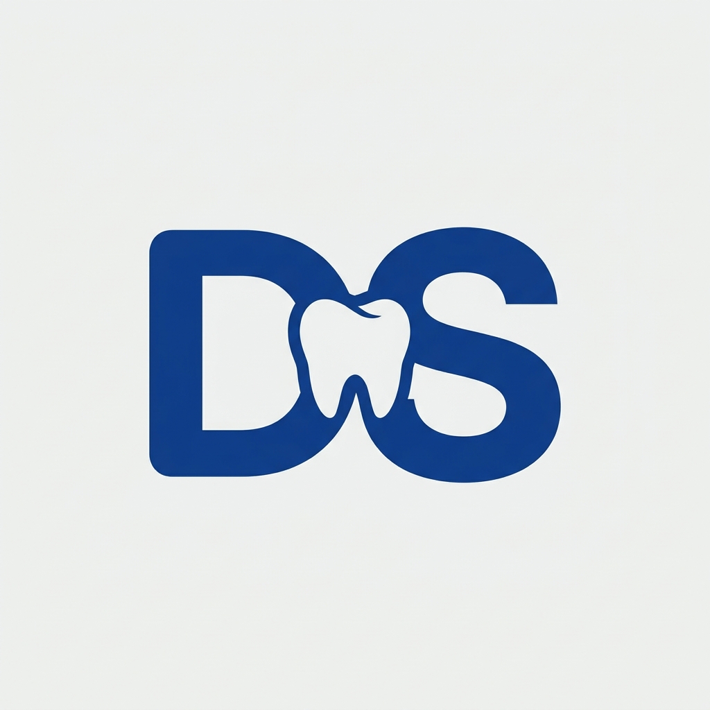
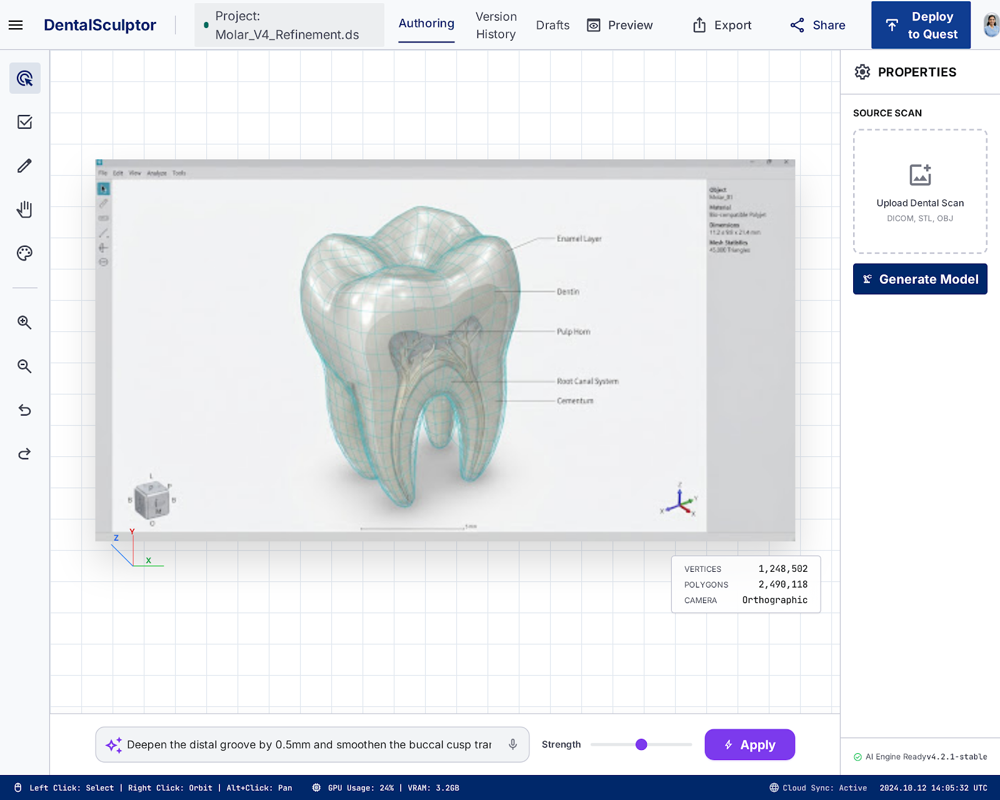
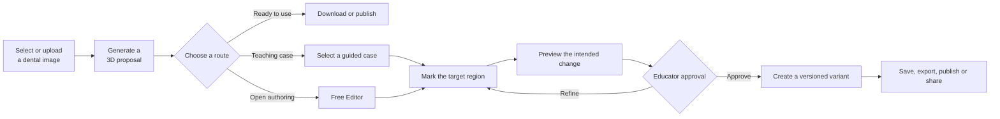
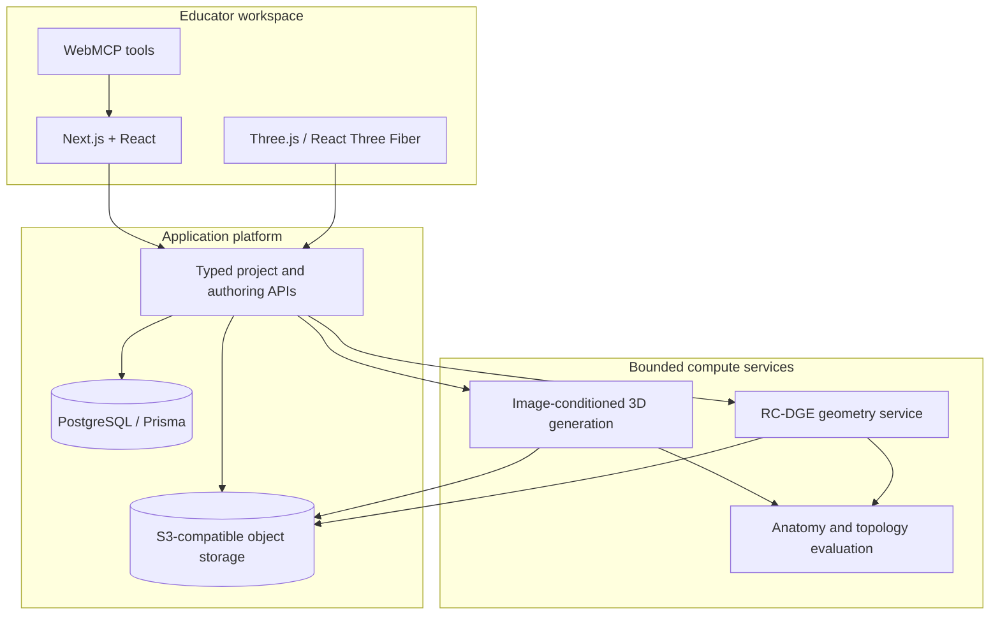

<div align="center">
  

  # DentalSculptor

  **From a dental image to an inspectable, editable and reusable 3D teaching case.**

  DentalSculptor is an AI-aided authoring platform that helps dental educators reconstruct tooth models, create clinically meaningful teaching variants, and deliver them to learners and simulation systems—without requiring a professional 3D-modelling workflow.

  [](https://dentalsculptor.vercel.app/)
  [](https://youtu.be/_k1b-IaoP_8)
  [](./LICENSE)

  *A doctoral research project in educator agency, pedagogical ownership and human–AI co-creation in dental education.*
</div>



## The problem

Dental schools increasingly use virtual and haptic simulation, but authoring the underlying 3D content still depends on specialist modelling skills, fragmented software and lengthy asset-preparation pipelines. A generated mesh alone does not solve that problem. Educators need to inspect the proposed anatomy, express a teaching intention, make a controlled change, compare variants, and export a dependable asset.

DentalSculptor treats this as an **authoring problem**, not only a generation problem.

> **AI proposes. Geometry constrains. The educator decides.**

## The contribution: generative + deterministic authoring

DentalSculptor combines two complementary paths inside one project-centred workflow:

| Path | What it does | Why it matters |
|---|---|---|
| **Generative reconstruction** | Uses an image-conditioned 3D foundation model built on TRELLIS.2 Structured Latents to propose a textured whole-tooth model from a selected image. | Gives educators an accessible starting asset without manual mesh construction. |
| **Deterministic case authoring** | Applies bounded, repeatable geometry operations to educator-marked regions for suitable teaching cases. | Local changes do not need to regenerate—or unpredictably reshape—the whole tooth. |
| **Human approval** | Preserves the source, master model, preview, decision history and derived variants. | The educator retains clinical judgement and pedagogical ownership. |

The deterministic subsystem is formalised as **Region-Constrained Dental Geometry Editing (RC-DGE)**: a fail-closed editing contract that validates target intersection, limits the affected region, preserves the accepted master, checks the resulting mesh and records a new variant rather than overwriting the source.

## The educator workflow



1. **Select a source** — upload an image, choose a hosted example or use a permitted URL.
2. **Generate and inspect** — follow asynchronous progress, then orbit, zoom and fit the reconstructed model.
3. **Choose the outcome** — download/publish the accepted reconstruction, create a guided teaching case, or enter the Free Editor.
4. **Author a case** — select a case-specific action, mark the affected anatomy and review the automatically composed instruction.
5. **Preview and approve** — compare the proposed change, refine it if necessary, and explicitly approve creation.
6. **Disseminate** — export a simulator-oriented bundle, publish to the community, share a link or clone an existing public project.

## What educators can create

The platform deliberately uses the least uncertain method capable of meeting the teaching objective.

| Teaching case | Current authoring strategy | Scope boundary |
|---|---|---|
| Tooth identification and annotations | Metadata and labels | No geometry change required |
| Cusp fracture / chipped enamel | Local cut or subtractive removal | External morphology teaching asset |
| Simple Class I cavity | Bounded occlusal subtraction | Educational geometry, not lesion biology |
| Endodontic access opening | Controlled access preparation | Does not infer patient-specific pulp anatomy |
| Caries appearance | Surface appearance, with optional shallow geometry | Visual teaching representation, not tissue mechanics |
| Crown reduction | Controlled surface removal | Requires quantitative validation before assessment use |
| Jaw placement | FDI-aware positioning and orientation | Authoring aid rather than diagnostic occlusion |

## Designed around pedagogical ownership

- **Source continuity** — the selected image remains attached to the project and available in the editor.
- **Immutable master assets** — edits create variants; they do not silently replace the accepted reconstruction.
- **Progressive disclosure** — guided cases show only the controls needed for that case, while Free Editor supports open exploration.
- **Matched preview and approval** — the user sees what is proposed before a new 3D variant is committed.
- **Visible system state** — queued, running, finalising, completed and failed states remain distinguishable during long-running work.
- **Traceable dissemination** — exports and published projects retain project, variant and asset lineage.
- **Fail-closed geometry** — invalid intersections, empty outputs and unsupported topologies preserve the master and return an actionable error.

## Product capabilities

| Area | Capabilities |
|---|---|
| **3D generation** | Image upload/library/URL input, asynchronous GPU jobs, stable project assets, deterministic generation settings where supported |
| **Authoring** | Guided cases, Free Editor, brush/region/line targeting, semantic instructions, 2D preview, deterministic variants, undoable project history |
| **3D workspace** | Three.js viewer, fit-to-view, orbit/zoom, source comparison, revision history, jaw placement and case-aware panels |
| **Delivery** | GLB/STL download, teaching bundles, simulator-oriented export metadata, publishing, sharing, likes, downloads and cloning |
| **Collaboration** | Public project pages, clone-to-own-project flow, community engagement and shareable links |
| **Research** | Consent-aware event capture, reproducible ML experiments, patient-disjoint evaluation contracts and expert-review gates |
| **Agent collaboration** | Page-scoped WebMCP tools operating on the same visible project and approval state as the educator |

## Architecture



The web application remains responsive while long-running GPU work executes asynchronously. Database records carry ownership and state; object storage carries source images, meshes and export bundles; background services return durable artefacts before a project is marked ready.

## WebMCP: agents inside the same workspace

WebMCP is an additional interaction surface—not a separate product. Compatible agents can inspect application state, start supported workflows, synchronise case presets and prepare export or publishing actions. They operate against the same project, model, revision history and permission boundaries visible to the educator.

Sensitive or irreversible decisions remain human-controlled: choosing source material, marking anatomy, approving a case variant, confirming privacy and authorising release.

- [WebMCP overview and tool contract](./docs/webmcp/README.md)
- [Implementation and verification notes](./docs/WEBMCP_IMPLEMENTATION.md)
- [Challenge project story](./docs/webmcp/PROJECT_STORY.md)
- [Judge and tester guide](./docs/webmcp/JUDGE_GUIDE.md)
- [Live diagnostics](https://dentalsculptor.vercel.app/webmcp)

## Anatomy research programme

The production system is accompanied by a reproducible research pipeline for improving anatomical fidelity—especially posterior crown morphology, cusps, ridges, grooves and incisal enamel extent—without regressing comparatively stronger root geometry.

The proposed next-stage model research is **DSLAT (Dental Disentangled Structured Latents)**. It separates evaluation and supervision by anatomical responsibility:

| Factor | Intended responsibility | Primary evidence source |
|---|---|---|
| Identity and pose | Tooth family, FDI position and whole-tooth orientation | Project metadata and image-language conditions |
| Crown detail | Cusps, fossae, grooves, ridges and incisal extent | 3Shape FDI 16 and Teeth3DS surface geometry |
| Cervical continuity | Plausible crown–root transition | Whole-tooth meshes derived from volumetric labels |
| Root preservation | Root number, length, curvature and completeness | ToothFairy2-derived whole-tooth surfaces |

Candidate models are not promoted on attractive renders alone. The research contract requires frozen baselines, patient-disjoint splits, repeatability, topology checks, whole-tooth and regional metrics, tooth-family reporting, root/cervical non-regression and blinded expert review. Inconclusive experiments are retained as engineering evidence rather than reported as anatomical improvement.

See [the fine-tuning workspace](./dentalsculptor-ml/finetune/README.md), [research protocol](./docs/DENTAL_TRELLIS_RESEARCH_REPORT_PROTOCOL.md) and [current progress record](./docs/PROGRESS.md).

## Technology

| Layer | Stack |
|---|---|
| Web application | Next.js 16, React 19, TypeScript, Tailwind CSS 4 |
| 3D experience | Three.js, React Three Fiber, Drei |
| Data and identity | Supabase Auth, PostgreSQL, Prisma 7 |
| Asset storage | AWS S3-compatible object storage |
| GPU workloads | Modal, PyTorch, TRELLIS.2-based generation services |
| Geometry | Python mesh processing and browser-side export validation |
| Agent interface | WebMCP via `document.modelContext` |
| Deployment | Vercel for the web application; independently versioned GPU services |

## Run locally

### Prerequisites

- Node.js 20+
- npm
- PostgreSQL/Supabase project
- S3-compatible storage
- Optional Modal endpoints for live generation and editing

```bash
git clone https://github.com/joboyebisi/dentalsculptor.git
cd dentalsculptor/dentalsculptor-app
npm install
cp .env.example .env.local

# Configure the values documented in docs/ENV.md
npm run db:push
npm run dev
```

Open [http://localhost:3000](http://localhost:3000).

For interface work without live infrastructure, set `UI_PREVIEW_MODE=true` and open `/editor/preview-project-1`.

### Useful checks

```bash
cd dentalsculptor-app
npm run lint
npm run test:case-workflows
npm run test:export-stl
npm run test:viewer
npm run test:webmcp
```

ML and geometry tests live under [`dentalsculptor-ml/tests`](./dentalsculptor-ml/tests/). Dataset files, model weights, patient-derived assets and generated experiment artefacts are intentionally excluded from Git.

## Repository map

```text
DentalSculptor/
├── dentalsculptor-app/       # Production Next.js authoring platform
├── dentalsculptor-ml/        # Generation, geometry and research pipelines
│   ├── modal_app/            # Versioned GPU and geometry services
│   ├── scripts/              # Dataset, benchmark and evaluation tooling
│   ├── tests/                # ML/geometry regression and evidence tests
│   └── finetune/             # Dataset contracts and experiment configs
├── docs/                     # Architecture, workflow, deployment and research docs
├── research/validation/      # Small, reviewable validation inputs
├── stitch_dentalsculptor_xr_authoring_platform/
│                             # UI design references
├── bloom-v0/                 # Earlier 3D-generation integration reference
└── README.md
```

## Documentation

| Start here | Purpose |
|---|---|
| [Project walkthrough](./docs/PROJECT_WALKTHROUGH.md) | Product context, architecture, file map and implementation status |
| [Clinical authoring workflows](./docs/CLINICAL_AUTHORING_WORKFLOWS.md) | Tooth, jaw, case-authoring and export UX contracts |
| [Real-time evaluation handoff](./docs/REALTIME_EVALUATION_HANDOFF.md) | Generation → authoring → export pilot path and acceptance gates |
| [Architecture](./dentalsculptor-app/ARCHITECTURE.md) | Application, data, authentication and API structure |
| [Deployment guide](./docs/DEPLOYMENT.md) | Web deployment, GPU services and configuration safeguards |
| [Environment variables](./docs/ENV.md) | Required and optional runtime configuration |
| [Anatomical reconstruction recovery plan](./docs/ANATOMICAL_RECONSTRUCTION_RECOVERY_PLAN.md) | Evidence-led model-improvement strategy |
| [Research report protocol](./docs/DENTAL_TRELLIS_RESEARCH_REPORT_PROTOCOL.md) | Reproducible experimental and reporting contract |
| [Development progress](./docs/PROGRESS.md) | Detailed engineering and research record |

## Research and responsible use

DentalSculptor is an academic research and educational authoring platform. Generated or edited assets are proposals for educator review; they are not patient-specific reconstructions, diagnostic devices, treatment recommendations or validated substitutes for expert anatomical assessment. Case-specific scope and provenance should accompany exported assets.

Participant data, restricted datasets, model weights and local experiment artefacts are not included in this public repository. Dataset use remains subject to each source's licence and governance requirements.

## Contributing

Issues and focused pull requests are welcome. Please include:

1. the educator or learner problem being addressed;
2. the expected project/asset state transition;
3. tests for geometry, export or workflow behaviour where relevant; and
4. an explicit statement of any clinical or evidential limitation.

## Project links

- **Application:** [dentalsculptor.vercel.app](https://dentalsculptor.vercel.app/)
- **Demonstration:** [youtu.be/_k1b-IaoP_8](https://youtu.be/_k1b-IaoP_8)
- **Source:** [github.com/joboyebisi/dentalsculptor](https://github.com/joboyebisi/dentalsculptor)

## License

DentalSculptor's source code is released under the [MIT License](./LICENSE). Third-party models, datasets and assets retain their respective licences.
