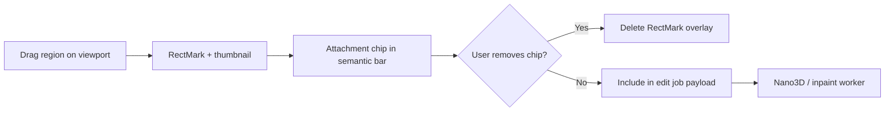

# Editor interaction framework

**Updated:** 23 August 2026  
**Audience:** Educators, tutorial authors, Nano3D / future edit model integrators

This document defines how users select *where* to edit, *what* operation to apply, and *how* semantic text reaches the Nano3D Case 3 pipeline.

---

## Design principles

1. **Spatial selections persist** — region marks and brush masks stay visible after switching tools (select, zoom, pan).
2. **Attachments mirror marks** — each region mark becomes a numbered chip in the semantic edit bar; removing a chip removes the mark.
3. **One coherent edit contract** — mask pixels + region rectangles + instruction text + operation (`add` | `remove` | `replace`) are sent together to the edit job API.
4. **Preview before 3D** — 2D inpaint approval (Case 3) uses the captured view + mask; region marks constrain prompt expansion.
5. **Non-destructive history** — undo/redo applies to the active modality (mask strokes or region marks).

---

## Workflow (tutorial order)

```text
1. Case preset (optional)  →  default operation + suggested prompt
2. Region mark OR mask paint  →  where to edit
3. Add / Remove / Replace     →  Nano3D operation mode
4. Semantic instruction       →  natural language (+ attachment chips)
5. Preview 2D                 →  approve inpainted reference
6. Generate 3D                →  Nano3D Case 3 → new GLB revision
7. Export                     →  choose scope + format (STL/OBJ/GLB/PLY)
```

---

## Tools

| Tool | Behaviour | Persists after deselect? |
|------|-----------|------------------------|
| **Select** | Click mesh / toggle parts in properties panel | Selection highlight |
| **Region mark** | Drag rectangle on viewport; numbered attachment in edit bar | Yes — overlays stay |
| **Mask paint** | Purple brush defines editable pixels for 2D inpaint | Yes — overlay stays visible |
| **Pan** | Left-drag pans camera (OrbitControls) | N/A |
| **Zoom in / out** | Programmatic dolly toward target | N/A |
| **Wireframe** | Toggles mesh wireframe | Until toggled off |
| **Undo / Redo** | Mask strokes when mask has paint; else region marks | N/A |

Region marks and masks can be used together: marks carry semantic labels; mask carries pixel-accurate edit bounds for Nano3D Case 3.

---

## Region mark → attachment sync



- Marks are numbered **Region 1**, **Region 2**, …
- Thumbnail = cropped capture from the current viewport at mark time.
- Instruction text is augmented with `Target regions: [Region 1] [Region 2]` for the worker.

---

## Nano3D edit payload (client → API)

| Field | Source |
|-------|--------|
| `instruction` | Semantic bar (+ region refs) |
| `operation` | Add / Remove / Replace toolbar |
| `maskImage` | Brush overlay PNG (white = editable) |
| `referenceImage` | Captured viewport at preview time |
| `camera` | Serialized camera for view consistency |
| `regionMarks` | JSON array of normalized rects + optional 3D corners |
| `selectedPartIds` | Parts panel visibility |

Case 3 uses **edited 2D reference + source GLB** — the mask defines inpaint bounds; region marks guide prompt expansion and future Steer3D-style steering.

---

## Export

| Scope | Meaning |
|-------|---------|
| **Full model** | Entire generated / edited mesh |
| **Selected parts** | Only visible parts (when segmentation is enabled) |

| Format | Typical use |
|--------|-------------|
| **STL** | Simodont, SimtoCARE, Virteasy, 3D print |
| **OBJ** | CAD / Blender interchange |
| **GLB** | Web viewer, Meta Quest |
| **PLY** | Point-cloud tools, some simulators |

Export uses the **current model URL** in the editor session (including unsaved Nano3D revisions).

---

## Future edit models

Any replacement for Nano3D should accept the same contract:

- Persisted spatial UI (marks + mask)
- Attachment UX linked to mark lifecycle
- Operation enum (`add` | `remove` | `replace`)
- 2D approval gate before 3D mesh swap

See also: [3D_EDITING_RESEARCH.md](./3D_EDITING_RESEARCH.md), [GENERATION_AND_EDITING_RESEARCH.md](./research/GENERATION_AND_EDITING_RESEARCH.md).
