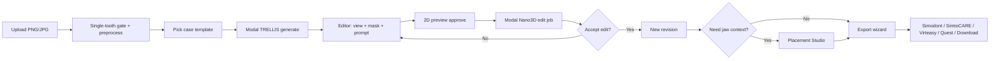

# Milestone E0–E2 — Single-tooth authoring to simulator-ready export

**Status:** Active milestone (target ~5–6 weeks)  
**Updated:** 17 August 2026  
**Goal:** An educator can upload a **single-tooth PNG/JPG**, generate a 3D model on **Modal (TRELLIS)**, edit it with **Nano3D** (mask + text), optionally **place it on a jaw template**, and **export** watertight assets for **Simodont, SimtoCARE, Virteasy, Meta Quest**, or download for teaching.

**Out of scope for this milestone:** whole jaw / oral cavity from one photo, CBCT/DICOM, IOS segmentation, multi-tooth FDI workflows. Those are grouped in [MILESTONE_E3_PLUS.md](./MILESTONE_E3_PLUS.md).

---

## 1. Success definition

| Criterion | Measure |
|-----------|---------|
| End-to-end journey | Upload → preprocess → generate → edit → (optional) place → export completes without manual CLI |
| Export fidelity | STL passes watertight check; dimensions in mm; Simodont preset validated on sample import |
| Edit auditability | Every accepted edit creates immutable revision with mask, camera, prompt, provider version |
| Pedagogy | Educator picks a **clinical case template** + student year level; learning objectives pre-filled |
| Research | `ResearchEvent` trail from upload through export; pedagogical ownership inputs captured |
| Cost | Generation + edit jobs run on Modal (~$250 credits); storage hybrid avoids Supabase free-tier limits |

---

## 2. User journey (watertight UX)



### Step-by-step screens

| Step | Screen | User action | System |
|------|--------|-------------|--------|
| 0 | Landing / New project | Upload PNG or JPG | Show **single-tooth scope banner**; reject non-images |
| 1 | Preprocess review | Confirm crop / background | `prepareGenerationImage()` + optional auto-crop UI |
| 2 | Case wizard | Pick procedure + year level | Load template from `case-templates.ts`; set title, LOs, hints |
| 3 | Generate | Start generation | `POST /api/generate/mesh` → Modal TRELLIS worker; poll job |
| 4 | Editor | Inspect mesh | Load GLB; status bar; revision v1 |
| 5 | Edit mode | Rotate view, paint mask, text, add/remove/replace | Capture camera; store mask PNG |
| 6 | 2D preview | Approve masked inpaint | External or Modal image-edit worker; no 3D spend until approve |
| 7 | 3D edit job | Wait with progress | Nano3D Case 3 (source GLB + edited reference image) |
| 8 | Compare | Before / after | Accept → new revision; Reject → retry |
| 9 | Placement (optional) | Pick jaw template + FDI socket | Transform gizmo; merge tooth + jaw |
| 10 | Export wizard | Pick target platform | Watertight check, decimate, axis/units preset |
| 11 | Done | Download or copy link | Track `EXPORT_REQUESTED`; optional assign to students |

### UX copy (scope gate)

> **Single tooth only (beta)**  
> Upload a clear photo of **one tooth** (PNG or JPG). Whole-jaw and oral-cavity workflows are coming in a later release. For best results: plain background, good lighting, tooth fills most of the frame.

---

## 3. Phase breakdown

| Phase | Deliverable | Weeks | Exit criteria |
|-------|-------------|-------|---------------|
| **E0** | Modal TRELLIS generate + Nano3D edit; mask + text UI | 2–3 | 20 dental benchmark edits; accept/reject flow; job API live |
| **E1** | Export wizard (Simodont + multi-platform presets, watertight check) | 1 | STL imports into Simodont sample course; Quest GLB loads in `/xr/[id]` |
| **E2** | Placement Studio (template jaw + transform + merge) | 2 | Merged STL exports with correct socket position |

See [3D_EDITING_RESEARCH.md](./3D_EDITING_RESEARCH.md) for edit API and Modal worker design.

---

## 4. ML stack (Modal)

### 4.1 Generation — Microsoft TRELLIS

| Item | Choice |
|------|--------|
| Host | Modal.com (`dentalsculptor-ml/`) |
| GPU | `A100-40GB` (recommended by TRELLIS); fallback `L40S` |
| Input | Preprocessed JPEG, single tooth, ≥512px longest side |
| Output | GLB + thumbnail PNG |
| Weights | Modal Volume `trellis-weights-v1` (pinned commit) |
| Fine-tune | **Phase E0 spike only** — LoRA on de-identified teaching photos if benchmark shows systematic bias (orientation, cusp exaggeration). Not blocking v1. |

**Replace fal.ai:** Next.js route calls Modal webhook; fal remains fallback when `MODAL_TOKEN` unset.

### 4.2 Editing — Nano3D v1 (TRELLIS extension)

| Item | Choice |
|------|--------|
| Route | **Case 3:** user-approved edited 2D reference + source GLB |
| GPU | `L40S` (48 GB); upgrade to `A100-80GB` if OOM |
| Mask | Applied in **2D inpaint step** before Nano3D (Nano3D has no native paint API) |
| Operations | `add` \| `remove` \| `replace` |
| Fine-tune | Optional later — collect accept/reject revision pairs for custom feed-forward editor |

### 4.3 2D inpaint (mask + text)

| Option | VRAM | Decision |
|--------|------|----------|
| Qwen-Image (Nano3D local) | ~60 GB | Defer — use API first |
| fal / Replicate masked inpaint | API | **E0 default** |
| Modal SDXL inpaint | ~24 GB | Backup |

### 4.4 Image preprocessor (before 3D)

Client + server pipeline in `prepare-generation-image.ts`:

1. Accept PNG/JPG only (WebP → JPEG).
2. Reject if &lt;256px or &gt;5000px longest side.
3. Downscale to max 1536px; JPEG quality 0.88.
4. **Dental heuristics (E0.1):** optional luminance normalization; warn if aspect ratio suggests full arch.
5. Store original + processed URLs for audit.

Future: U²-Net or rembg background removal on Modal CPU worker.

---

## 5. Storage architecture

Supabase free tier (~1 GB) is insufficient for GLB/STL churn. **Hybrid:**

| Asset type | Primary store | Notes |
|------------|---------------|-------|
| Source images (small) | Supabase Storage | Thumbnails, &lt;500 KB processed |
| GLB/STL (large) | **Amazon S3** | Job I/O; signed URLs; use your AWS credits |
| Model weights | Modal Volume | Read-only mount in GPU containers |
| DB metadata | Supabase Postgres | URLs, job IDs, revision JSON |
| Temp job scratch | Modal ephemeral disk | Deleted after upload to R2/Volume |

**Recommended v1:** **Amazon S3** for user assets + Modal Volume for ML weights only. Set `STORAGE_BACKEND=s3` in Next.js (existing `lib/s3.ts` / `lib/storage.ts` abstraction).

Modal **does not** replace Postgres; use Modal for compute + optional Volume cache, not as primary CDN for browser downloads.

See also: [HAPTIC_EXPORT_STRATEGY.md](./HAPTIC_EXPORT_STRATEGY.md), [JAW_TEMPLATE_ASSETS.md](./JAW_TEMPLATE_ASSETS.md), [FINETUNING_DTU_DATASET.md](./FINETUNING_DTU_DATASET.md), [3D_VIEWER_STACK.md](./3D_VIEWER_STACK.md), [STITCH_MOCKUP_PROMPTS.md](./STITCH_MOCKUP_PROMPTS.md).

### Export tiers (haptic realism)

Custom STL from DentalSculptor delivers **Tier A — geometry prep (uniform drill feel)**. Soft caries haptics require Simodont native library or TrueTeethLab (CBCT) — **Tier C**, planned E3+. See [HAPTIC_EXPORT_STRATEGY.md](./HAPTIC_EXPORT_STRATEGY.md).

Caries case templates in E0–E2 are renamed to **"cavity design (geometry)"** — valid for prep form training, not soft-tissue feel.

---

## 6. Export matrix

Presets live in `dentalsculptor-app/src/lib/export-presets.ts`.

| Target | Format | Units | Scale | Watertight | Notes |
|--------|--------|-------|-------|------------|-------|
| **Simodont** | STL (ASCII/binary) | mm | 1:1 real tooth | Required | Axis-aligned; Z-up or Y-up per manual; crop to tooth; max ~500k tris after decimation |
| **SimtoCARE Dente** | STL or PLY | mm | 1:1 | Required | IOS import path; 100³ mm workspace — single tooth fits |
| **Virteasy Dental** | STL | mm | 1:1 | Required | Exercise import + 3D print path; Unreal prefers clean normals |
| **Meta Quest (in-app)** | GLB | meters | ~0.01 m/tooth height | Preferred | Draco optional; &lt;20 MB; PBR materials simplified |
| **Meta Quest (side-load)** | GLB | meters | as above | Preferred | Same as WebXR `/xr/[id]` export |
| **Teaching download** | GLB + STL | mm | 1:1 | STL required | ZIP bundle with README |

### Simodont-specific (from courseware manual)

- STL or PLY, **millimetres**, **watertight**, **cropped** to relevant anatomy.
- Avoid non-manifold edges; run `meshfix` / PyMeshLab pipeline on Modal CPU worker before download.
- Educator validates import in Simodont Teacher before publishing to class.

### Validation pipeline (E1)

```
GLB → trimesh load → watertight? → self-intersection check → 
  scale to mm → decimate (target tris) → axis reorient (preset) → STL write → 
  optional PLY for SimtoCARE
```

---

## 7. Clinical case templates (pedagogical ownership)

Catalog: `dentalsculptor-app/src/lib/case-templates.ts`.

Templates drive **case wizard** step 2: pre-fill title, learning objectives, suggested AI prompts, assessment rubric hints, and export target.

### By student year (UK BDS-style)

| Year | Focus | Example cases |
|------|-------|---------------|
| **1** | Anatomy & morphology | Identify cusps/fossa; compare incisor vs molar shape |
| **2** | Caries recognition | Occlusal caries lesion; smooth-surface early lesion |
| **3** | Operative prep | Class I amalgam prep; Class II box only |
| **4** | Crown & endo access | Full-crown prep on premolar; endodontic access cavity |
| **5 / MFDS** | Advanced sim | Deep caries + pulp exposure; crown prep with retention |

### By procedure (TrueTeethLab-inspired)

| ID | Procedure | Typical edit prompts |
|----|-----------|---------------------|
| `anatomy-id` | Tooth identification | None — generate only |
| `caries-occlusal` | Caries excavation sim | Remove decay (replace with cavitation) |
| `caries-smooth` | Smooth surface | Remove demineralized enamel |
| `prep-class1` | Class I cavity | Remove enamel/dentin to ideal prep form |
| `prep-class2` | Class II | Box + isthmus shaping |
| `crown-prep` | Crown preparation | Reduce axial/occlusal; add chamfer |
| `endo-access` | Endodontic access | Remove roof of pulp chamber |
| `lesion-add` | Pathology teaching | Add ulceration / fracture (replace) |

Each template includes:

- `studentYearLevels[]`
- `learningObjectives[]`
- `suggestedPrompts[]` (for edit step)
- `exportRecommendation` (Simodont default for haptic sims)
- `ownershipMetrics` — fields for research (who chose template vs custom, edit count, export destination)

---

## 8. API surface (new / changed)

| Route | Method | Purpose |
|-------|--------|---------|
| `/api/generate/mesh` | POST | **Change:** Modal TRELLIS primary; fal fallback |
| `/api/generate/jobs/[id]` | GET | Poll generation job |
| `/api/projects/[id]/edit-jobs` | POST | Submit mask + camera + instruction |
| `/api/edit-jobs/[id]` | GET | Poll edit job + preview URLs |
| `/api/projects/[id]/revisions` | GET/POST | List / accept revision |
| `/api/projects/[id]/export` | POST | `{ preset: "simodont" \| ... }` → job |
| `/api/export/jobs/[id]` | GET | Download URL when ready |
| `/api/projects/[id]/placement` | PATCH | Save jaw template + transform |
| `/api/case-templates` | GET | List templates for wizard |

### Schema additions (Prisma — implement in E0)

```prisma
model ModelRevision {
  id          String   @id @default(cuid())
  projectId   String
  version     Int
  glbUrl      String
  source      String   // "trellis" | "nano3d" | "merge"
  metadata    Json?    // mask, camera, prompt, provider, seed
  createdAt   DateTime @default(now())
  project     Project  @relation(...)
}

model MlJob {
  id          String   @id @default(cuid())
  projectId   String?
  type        String   // "generate" | "edit" | "export" | "merge"
  status      String
  modalCallId String?
  input       Json?
  output      Json?
  createdAt   DateTime @default(now())
  updatedAt   DateTime @updatedAt
}
```

---

## 9. UI work & design requests

Existing Stitch references: `stitch_dentalsculptor_xr_authoring_platform/advanced_authoring_workspace_v3/`.

### New screens needed (design review)

| Screen | Priority | Notes |
|--------|----------|-------|
| **Case wizard** (template + year picker) | P0 | Card grid; filter by year/procedure |
| **Single-tooth upload banner** | P0 | Amber info callout on landing uploader |
| **Edit mode overlay** | P0 | Brush toolbar on captured view; extends rect-mark UX |
| **2D preview modal** | P0 | Side-by-side source vs inpaint; Approve / Retry |
| **Revision timeline** | P1 | Left rail: v1 generate, v2 edit, v3 merge |
| **Export wizard** | P0 | Stepper: target → validate → download |
| **Placement Studio** | P1 | Split view: jaw template + tooth gizmo + FDI picker |

Please provide Stitch mockups for **Case wizard**, **Export wizard**, and **Placement Studio** if deviating from v3 workspace chrome.

---

## 10. Engineering checklist

### E0 — Generate + edit (weeks 1–3)

- [ ] Scaffold `dentalsculptor-ml/` Modal app (TRELLIS + Nano3D)
- [ ] Modal Volume for weights; R2 for job outputs
- [ ] Wire `/api/generate/mesh` to Modal
- [ ] Implement edit-jobs API per `3D_EDITING_RESEARCH.md`
- [ ] Mask paint UI on `cam-model-viewer` (brush, erase, undo)
- [ ] 2D inpaint integration (fal masked edit or Modal)
- [ ] `ModelRevision` + immutable accept flow
- [ ] Single-tooth banner + preprocessor enhancements
- [ ] Case wizard UI + `case-templates.ts`
- [ ] Research events: `CASE_TEMPLATE_SELECTED`, `EDIT_JOB_*`, `REVISION_ACCEPTED`

### E1 — Export (week 4)

- [ ] `export-presets.ts` + `/api/projects/[id]/export`
- [ ] Server-side watertight validation (trimesh / pymeshlab on Modal CPU)
- [ ] Export wizard UI
- [ ] Simodont validation doc + sample file in `docs/fixtures/`
- [ ] Quest GLB export from same mesh (scale transform)

### E2 — Placement (weeks 5–6)

- [ ] Jaw template library (STL/GLB): adult upper/lower quadrant meshes (CC0 or licensed)
- [ ] FDI socket markers (approximate transforms per tooth)
- [ ] Three.js transform gizmo + snap
- [ ] Boolean merge / combine STL export
- [ ] Placement state on `DentalModel.meshData`

### E2E test

See [E2E_TEST_PLAN_E0_E2.md](./E2E_TEST_PLAN_E0_E2.md).

---

## 11. Cost estimate (Modal)

| Job | GPU | Est. duration | Est. cost |
|-----|-----|---------------|-----------|
| TRELLIS generate | A100-40GB | 60–120 s | ~$0.05–0.15 |
| Nano3D edit | L40S | 90–180 s | ~$0.08–0.20 |
| Export/fix | CPU | 5–15 s | ~$0.001 |
| 2D inpaint (API) | — | 10–30 s | ~$0.02 |

~$250 credits ≈ **800–1500 full author journeys** (generate + 1 edit + export) before optimization.

---

## 12. Risks & mitigations

| Risk | Mitigation |
|------|------------|
| Nano3D direct-GLB fidelity loss | Prefer Case 3 (image edit route); benchmark 20 cases before UI ship |
| TRELLIS wrong scale/orientation | Post-process normalize; manual gizmo in Placement Studio |
| Supabase storage full | R2 for meshes; keep Supabase for metadata only |
| Simodont import rejection | Watertight + manifold pipeline; educator test fixture |
| Whole-jaw user expectations | Persistent scope banner + case wizard copy |

---

## Related docs

- [3D_EDITING_RESEARCH.md](./3D_EDITING_RESEARCH.md)
- [MILESTONE_E3_PLUS.md](./MILESTONE_E3_PLUS.md)
- [E2E_TEST_PLAN_E0_E2.md](./E2E_TEST_PLAN_E0_E2.md)
- [IMPLEMENTATION_PLAN.md](./IMPLEMENTATION_PLAN.md)
