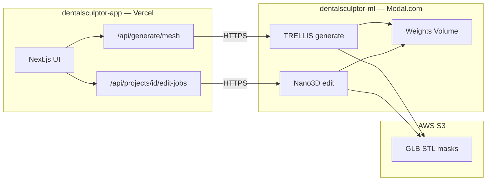

# Modal setup guide — TRELLIS + Nano3D inference

**Goal:** Deploy GPU workers in `dentalsculptor-ml/` and connect them to the Next.js app in `dentalsculptor-app/`.

---

## Architecture (two apps, one product)



| Repo folder | Runs on | Role |
|-------------|---------|------|
| `dentalsculptor-app/` | Vercel | UI, auth, Postgres, calls ML via HTTP |
| `dentalsculptor-ml/` | Modal | GPU inference only — **separate deploy** |

They are **not** a single Next.js app. Modal is a Python serverless GPU service with public HTTPS endpoints your API routes call.

---

## Step 1 — Modal account & CLI

```bash
pip install modal
python -m modal setup
```

Create tokens at [modal.com/settings](https://modal.com/settings) → API Tokens.

---

## Step 2 — Install ML repo deps (local, for deploy)

```bash
cd dentalsculptor-ml
python -m venv .venv
# Windows:
.venv\Scripts\activate
pip install modal
```

---

## Step 3 — Deploy stub (verify pipeline before TRELLIS)

We ship a **stub** first so Next.js can call real Modal URLs:

```bash
cd dentalsculptor-ml
modal deploy modal_app/app.py
```

Modal prints web endpoint URLs. Copy them into Vercel `.env`:

```env
ML_MESH_PROVIDER=modal
MODAL_TOKEN_ID=ak-...
MODAL_TOKEN_SECRET=as-...
MODAL_GENERATE_URL=https://YOUR-WORKSPACE--dentalsculptor-generate.modal.run
MODAL_EDIT_URL=https://YOUR-WORKSPACE--dentalsculptor-edit.modal.run
MODAL_JOB_STATUS_URL=https://YOUR-WORKSPACE--dentalsculptor-job-status.modal.run
MODAL_WEBHOOK_SECRET=choose-a-long-random-string
```

Until TRELLIS is integrated, stub returns a placeholder message — UI + job polling still work.

---

## Step 4 — S3 for job I/O

In AWS Console:

1. Create bucket `dentalsculptor-assets-prod` (eu-west-1 or your region).
2. IAM user with `s3:PutObject`, `s3:GetObject` on that bucket.
3. Add to **both** Vercel and Modal secrets:

```env
AWS_ACCESS_KEY_ID=
AWS_SECRET_ACCESS_KEY=
AWS_REGION=eu-west-1
AWS_S3_BUCKET=dentalsculptor-assets-prod
```

Flow: Next.js uploads source image → S3 signed URL → Modal reads → Modal writes GLB → S3 → URL returned to app.

---

## Step 5 — TRELLIS build spike (week 1)

1. Clone [microsoft/TRELLIS](https://github.com/microsoft/TRELLIS) inside Modal image build.
2. Create Modal Volume and download weights once:

```bash
modal volume create trellis-weights-v1
# populate during image build or setup script
```

3. GPU: `gpu="A100-40GB"` for generation.
4. Replace stub in `modal_app/workers/generate.py` with real inference.
5. Benchmark: cold start, seconds/job, credits/job.

---

## Step 6 — Nano3D edit worker

1. Clone [JAMESYJL/Nano3D](https://github.com/JAMESYJL/Nano3D) — use **Case 3** (edited 2D + source GLB).
2. GPU: `L40S` or `A100-80GB`.
3. Input: `sourceGlbUrl`, `editedImageUrl`, `maskImage`, `operation`.
4. Output: new GLB to S3.

2D inpaint can stay on fal until Qwen-Image Modal worker is ready.

---

## Step 7 — Wire Next.js (already scaffolded)

| File | Purpose |
|------|---------|
| `src/lib/ml-provider.ts` | `fal` \| `modal` \| `mock` switch |
| `src/app/api/generate/mesh/route.ts` | Calls Modal or fal |
| `src/app/api/projects/[id]/edit-jobs/route.ts` | Proxies to Modal edit |
| `src/app/api/edit-jobs/[jobId]/route.ts` | Poll job status |

**Provider priority:**

1. `ML_MESH_PROVIDER=modal` + Modal URLs configured → Modal  
2. Else `FAL_KEY` → fal (interim)  
3. Else mock mesh  

---

## Step 8 — Local dev workflow

```bash
# Terminal 1 — Next.js
cd dentalsculptor-app
npm run dev

# Terminal 2 — Modal serve (hot reload workers)
cd dentalsculptor-ml
modal serve modal_app/app.py
```

Point `MODAL_GENERATE_URL` at the `serve` local tunnel URL from Modal CLI output.

---

## Step 9 — Production checklist

- [ ] Modal deploy + secrets in Vercel
- [ ] S3 bucket + CORS for signed downloads
- [ ] `ML_MESH_PROVIDER=modal`
- [ ] fal kept as fallback (`generate/mesh` already falls back)
- [ ] E2E: landing upload → case wizard → generate → editor → mask → edit job → export wizard

---

## Cost estimate

| Job | GPU | ~Cost |
|-----|-----|-------|
| TRELLIS generate | A100-40GB, 90s | $0.08–0.15 |
| Nano3D edit | L40S, 120s | $0.10–0.20 |
| Stub / status | CPU | negligible |

~$250 credits ≈ 800–1200 full journeys before optimization.

---

## Troubleshooting

| Issue | Fix |
|-------|-----|
| `MODAL_GENERATE_URL is not configured` | Deploy stub; paste URL in `.env` |
| Modal 401 | Set `MODAL_WEBHOOK_SECRET` same on both sides |
| fal fallback unexpected | Modal failed — check Modal logs: `modal app logs dentalsculptor` |
| OOM on TRELLIS | Use A100-40GB; reduce image size to 1536px |

---

## Next implementation files

```
dentalsculptor-ml/
  modal_app/
    app.py              ← deploy entry (stub live)
    workers/
      generate.py       ← TRELLIS (TODO)
      edit.py           ← Nano3D (TODO)
```

See also: [MILESTONE_E0_E2.md](./MILESTONE_E0_E2.md), [3D_EDITING_RESEARCH.md](./3D_EDITING_RESEARCH.md).
