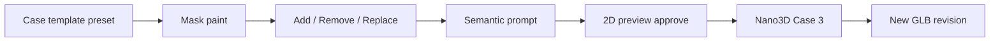

# Generation & editing research brief

**Updated:** 23 August 2026  
**Scope:** TRELLIS anatomical accuracy, multilayer export, texturing, and state-of-the-art editing paths for DentalSculptor E0–E3.

---

## Executive summary

| Track | Recommendation | Milestone |
|-------|--------------|-----------|
| **TRELLIS fine-tune** | Worth a **500-mesh spike** on DTU FDI-16; not an E0 blocker | E3 research |
| **Nano3D editing** | Ship **Case 3** (edited 2D + source GLB); mask + add/remove/replace + semantic prompt | E0 |
| **Multilayer teeth** | Template-warp from micro-CT library; label as *teaching anatomy*, not patient truth | E2–E3 |
| **Texturing** | PBR from multiview renders + optional enamel/dentin tints; haptics need tissue labels | E2 |
| **SOTA watch list** | Hunyuan3D-Buffalo, Steer3D, Trellis.2, InstantMesh+inpaint | Benchmark only |

Base TRELLIS already produces usable single-tooth shells for teaching. Fine-tuning improves **molar cusp fidelity** and **IOS-scale consistency** but requires rendered multiview training data. Editing quality depends more on **mask discipline + 2D inpaint + Case 3** than on mesh sculpting in-browser.

---

## 1. TRELLIS fine-tuning for anatomical accuracy

### What improves

- Cuspal morphology and fissure depth on maxillary first molars (DTU bias)
- Consistent mm scale and buccolingual width
- Fewer floating artifacts / non-manifold spikes on IOS-like inputs

### What does not improve (without other pipelines)

- Internal pulp, enamel thickness, or caries *feel* in haptics
- Correct pose when source photo angle is wrong (fix in UX: rotate image before generate)
- Text-only edits without mask

### Practical plan

1. **Baseline benchmark:** 20 clinical photos → base TRELLIS → educator rubric (cusp ID, occlusal form, artifacts).
2. **Data:** [DTU FDI-16](https://doi.org/10.11583/dtu.23626650) — 7,732 meshes; render 24–40 views/mesh (Blender or TRELLIS toolkit).
3. **Train:** Partial fine-tune on Modal multi-GPU; hold out official test split.
4. **Metrics:** Chamfer / F-score vs IOS; blind preference vs base; generation latency ±20%.
5. **Cost:** ~$200–800 for full run; **$50–100** for 500-mesh spike.

See also: [FINETUNING_DTU_DATASET.md](../FINETUNING_DTU_DATASET.md).

### Decision gate

Proceed to production fine-tune only if **≥60% educator preference** on held-out photos *and* no regression on non-molar uploads.

---

## 2. Multilayer edits & export

A single RGB photo cannot recover true enamel/dentin/pulp boundaries. DentalSculptor uses a **hybrid contract**:

```text
Photo → TRELLIS outer shell → template-warp internal labels → named mesh layers → export ZIP
```

### Label field (authoritative)

```text
0 background | 1 enamel | 2 dentin | 3 pulp | 4 caries | 5 restoration
```

### Export surfaces

| Consumer | Format | Notes |
|----------|--------|-------|
| Web / Quest | GLB multi-primitive | Visual materials per tissue |
| Simodont / SimtoCARE | STL ZIP + metadata JSON | Separate files; haptic props in sidecar |
| Teaching bundle | GLB + PDF provenance | Template ID + educator approval |

### “Edit hack” for layers

1. User edits **outer surface** via mask + Nano3D (add/remove/replace cusp, caries cavity, etc.).
2. On **accept revision**, re-run template registration: warp internal labels to new outer boundary.
3. Store immutable revision chain; export always references latest accepted outer + derived layers.

Nano3D modifies appearance/shape of the exterior; it does **not** natively output tissue volumes. Layer truth comes from **registration**, not from the generative edit alone.

See: [MULTILAYER_TOOTH_STRATEGY.md](../MULTILAYER_TOOTH_STRATEGY.md), [HAPTIC_EXPORT_STRATEGY.md](../HAPTIC_EXPORT_STRATEGY.md).

---

## 3. Texturing 3D models

### Goals

- **Visual:** enamel sheen, dentin at prep margins, caries contrast for VR demos
- **Not a substitute** for simulator haptic tissue IDs

### Tiered approach

| Tier | Method | When |
|------|--------|------|
| A | Vertex colors / single PBR from multiview bake | E0 preview |
| B | Per-primitive materials (enamel, dentin, pulp) from label mesh | E2 multilayer |
| C | Learned texture (MaterialGAN, TexFusion, MV-Adapter on dental renders) | E3+ research |

**Workflow:** After watertight mesh → render 8–12 views → bake albedo/roughness → optional inpaint stains (caries brown) in masked regions only.

---

## 4. Editing stack — Nano3D & alternatives

### Production path (E0)



- **Mask:** 2D overlay on captured view (not mesh vertices).
- **Operations:** map to Nano3D add/remove/replace semantics.
- **Case templates:** pre-fill operation, suggested prompts, protected anatomy roles.

See: [3D_EDITING_RESEARCH.md](../3D_EDITING_RESEARCH.md), [MODAL_SETUP_GUIDE.md](../MODAL_SETUP_GUIDE.md).

### Alternatives to benchmark (do not block ship)

| Method | Strength | Risk |
|--------|----------|------|
| **Steer3D** | Text steering without mask | General meshes; dental untested |
| **Hunyuan3D-Buffalo / Nano3D v2** | Unified gen+edit | Weights/licence timing |
| **Trellis.2** | Higher fidelity gen | Edit API TBD |
| **BrushNet + mesh** | Localized inpaint | Extra 2D step; same as Case 3 |

Run **20-case bake-off** on same GLB + prompts before switching off Nano3D Case 3.

---

## 5. UX levers that affect quality (no GPU)

Already shipping or planned:

- **Pose notice + image rotation** before generation (landing + new project + editor source)
- **Progress bar + elapsed time + stage labels** (async Modal jobs)
- **Dental prompt glossary** (`expandDentalPrompt`) — maps colloquial → anatomical language
- **Case wizard → editor** — default operation, suggested prompts, mask workflow panel

These often outperform marginal model gains for educator acceptance.

**Editor UX contract:** see [EDITOR_INTERACTION_FRAMEWORK.md](../EDITOR_INTERACTION_FRAMEWORK.md) — region-mark attachments, persistent masks, Nano3D payload fields.

---

## 6. Recommended sprint order

1. **E0:** Nano3D Case 3 on Modal; mask + preview + revision API; case template presets in editor ✅ (UI framework in progress).
2. **E0.5:** 20-case dental benchmark (base TRELLIS + Nano3D); log timing and failure modes.
3. **E1:** 2D inpaint worker (masked reference approval) before 3D submit.
4. **E2:** Template-warp multilayer prototype + export wizard tissue ZIP.
5. **E3:** DTU TRELLIS fine-tune spike; Steer3D/Buffalo benchmark; optional inpaint LoRA on accepted edits.

---

## References

- Microsoft TRELLIS — image-to-3D sparse structure
- JAMESYJL/Nano3D — Case 3 edited image + source GLB
- DTU 3Shape FDI-16 dataset — fine-tune corpus
- Internal: `docs/SPRINT_ROADMAP.md` Phase 2–3, `docs/MILESTONE_E0_E2.md`
