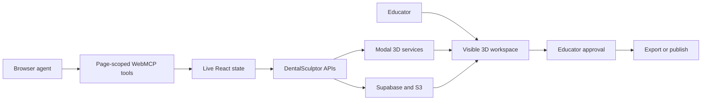

# DentalSculptor WebMCP

> The agent coordinates the workflow. The educator owns the anatomy, approval, and release.

DentalSculptor is a browser-based 3D teaching-case studio for dental educators. Its WebMCP
layer exposes structured tools from the same visible workspace used by the educator. An agent
can inspect state, generate a model from an educator-selected image, configure a teaching case,
coordinate a localized edit, and prepare the result for export or sharing without guessing at
screen coordinates.

## Try it

- Live application: <https://dentalsculptor.vercel.app>
- Live WebMCP diagnostics: <https://dentalsculptor.vercel.app/webmcp>
- Public source: <https://github.com/joboyebisi/dentalsculptor>

Use ChatGPT's in-app browser, or Chrome 149+ with
`chrome://flags/#enable-webmcp-testing` enabled.

## Why WebMCP belongs here

Dental case authoring combines long-running 3D generation, spatial targeting, clinical
parameters, reversible revisions, and simulator-specific exports. Screen automation is brittle
because the agent cannot reliably infer whether a model is loaded, which preset is valid, or
whether an edit has been approved. Full autonomy is also inappropriate: the educator must own
the anatomical and clinical decisions.

WebMCP creates a better division of work:

- the agent receives explicit state, schemas, prerequisites, and safe actions;
- the educator sees every result in the same 3D scene;
- spatial marking and clinical approval stay human-controlled;
- generated variants remain reversible until accepted;
- publishing, privacy confirmation, and downloads require deliberate approval.

## Architecture



The adapter in `dentalsculptor-app/src/components/webmcp/` uses Google Chrome Labs'
`use-webmcp-tool` React hook. At runtime it calls:

```javascript
document.modelContext.registerTool({
  name: "dentalsculptor_inspect_app",
  description: "Inspect the current DentalSculptor workspace and available next steps.",
  inputSchema: {
    type: "object",
    properties: {},
    additionalProperties: false,
  },
  execute: async () => ({
    content: [{ type: "text", text: "DentalSculptor is ready." }],
  }),
});
```

The hook unregisters page-scoped tools through `AbortSignal` when a React surface unmounts.
Browsers without WebMCP retain the complete conventional UI.

## Tool surfaces

DentalSculptor exposes 29 non-duplicated tools:

- **Global:** inspect the app or authentication state, create/open a safe authentication handoff,
  and navigate workspaces.
- **Generation:** inspect readiness, list/select curated tooth images, import an image, generate
  3D, and continue only after the model is visibly loaded.
- **Editor:** inspect viewer and workflow state, apply a teaching case, choose a preset, mark a
  target, preview, create and accept/reject a reversible variant, save, export, and open sharing.
- **Share dialog:** confirm public publishing and patient-privacy requirements.
- **Community:** inspect, link, like, and download published models.

Tool availability follows live state. For example, model-dependent editor tools are not
registered until the 3D viewer reports `ready`, and Create Variant is unavailable until a target
and approved preview exist.

## Documentation

- [Project story](./PROJECT_STORY.md)
- [Copy-ready Devpost fields](./DEVPOST_FIELDS.md)
- [Judge guide](./JUDGE_GUIDE.md)
- [Demo script](./DEMO_SCRIPT.md)
- [Requirements checklist](./REQUIREMENTS_CHECKLIST.md)
- [Pre-existing project delta](./PROJECT_DELTA.md)

## Verification

```powershell
cd dentalsculptor-app
npm install
npm run test:webmcp
npm run test:viewer
npm run test:case-workflows
npx tsc --noEmit
npm run build
```

`test:webmcp` verifies the complete tool manifest, unique names, page mounts, confirmation gates,
viewer-readiness gates, and that the installed adapter calls
`document.modelContext.registerTool`.
